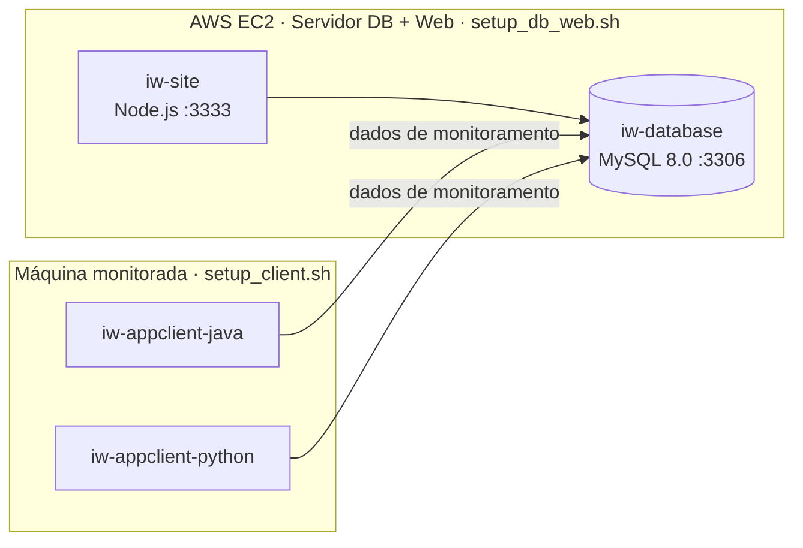

# iw-infra

Infraestrutura do projeto **InfraWatch**, plataforma de monitoramento de hardware: scripts de provisionamento, Dockerfiles e Docker Compose usados para subir o banco de dados, a aplicação web e os agentes de monitoramento. O servidor com banco e site roda em uma instância **AWS EC2**.

## Arquitetura

O ambiente é dividido em dois tipos de máquina (Ubuntu), cada uma com seu script de setup:



| Componente | Origem | Descrição |
|---|---|---|
| `iw-database` | [`iw-database`](https://github.com/Infra-Watch/iw-database) | MySQL 8.0.41, inicializado com o `scriptBD.sql` do repositório do banco. |
| `iw-site` | [`iw-appweb`](https://github.com/Infra-Watch/iw-appweb) | Aplicação web em Node.js na porta 3333. Faz `git pull` e `npm install` a cada inicialização. |
| `iw-appclient-java` | [`iw-appclient-java`](https://github.com/Infra-Watch/iw-appclient-java) | Agente Java executado como `.jar` em segundo plano. |
| `iw-appclient-python` | [`iw-appclient-python`](https://github.com/Infra-Watch/iw-appclient-python) | Agente Python executado em um virtualenv, em segundo plano. |

## Provisionamento na AWS EC2

O banco de dados e o site ficam em uma instância **EC2 com Ubuntu**, provisionada pelo `setup_db_web.sh`. O script parte do usuário padrão `ubuntu` da AMI e espera o repositório em `/home/ubuntu/iw-infra`. Ele não cria a instância; ela é criada antes, e o script é executado nela via SSH.

Com a instância no ar, o provisionamento é:

1. Acessar a instância via SSH com o usuário `ubuntu`.
2. Clonar este repositório em `/home/ubuntu`.
3. Executar `sudo bash setup_db_web.sh`. O script instala Docker e Docker Compose e sobe os containers `iw-database` e `iw-site` com `docker-compose up -d`.

O Security Group da instância precisa liberar as portas usadas: `22` para SSH, `3333` para o site e `3306` para o MySQL, caso ele seja acessado de fora da instância.

## Estrutura do repositório

| Arquivo | Uso |
|---|---|
| `docker-compose.yml` | Sobe os containers `iw-database` e `iw-site` a partir das imagens `davidomingues/meu_bd:latest` e `davidomingues/meu_site:latest` (Docker Hub), com volume persistente `mysql_data`. |
| `Dockerfile.bd` | Imagem do banco: MySQL 8.0.41 com o script de criação do schema em `/docker-entrypoint-initdb.d`. |
| `Dockerfile.site` | Imagem do site: Node.js com o repositório `iw-appweb` clonado e dependências instaladas. |
| `setup_db_web.sh` | Provisiona o servidor de banco e web na instância EC2. |
| `setup_client.sh` | Provisiona uma máquina cliente com os agentes de monitoramento. |

## Scripts de setup

Ambos precisam ser executados como root (`sudo`), atualizam o sistema e criam grupos, diretórios (com ACL) e usuários da equipe.

**`setup_db_web.sh`** (servidor)

1. Cria os grupos `infrawatch`, `DBA`, `front-end` e `devops` e os diretórios em `/infraweb`.
2. Instala Docker e Docker Compose.
3. Executa `docker-compose up -d` a partir de `/home/ubuntu/iw-infra`.

**`setup_client.sh`** (máquina monitorada)

1. Cria os grupos `infrawatch`, `DBA`, `back-end` e `devops` e os diretórios em `/home/infra`.
2. Instala o OpenJDK 21 (se necessário), clona o `iw-appclient-java` e inicia o `.jar` com `nohup`.
3. Instala Python 3 e `python3-venv` (se necessário), clona o `iw-appclient-python`, instala o `requirements.txt` e inicia o `app/main.py` com `nohup`.

## Como usar

### Servidor (banco + site) na EC2

Na instância EC2, conectado como `ubuntu`:

```bash
cd /home/ubuntu
git clone https://github.com/Infra-Watch/iw-infra.git
cd iw-infra
sudo bash setup_db_web.sh
```

Depois da execução, o site fica disponível na porta `3333` e o MySQL na `3306`.

### Máquina monitorada

```bash
git clone https://github.com/Infra-Watch/iw-infra.git
cd iw-infra
sudo bash setup_client.sh
```

### Gerar as imagens

O Compose usa imagens publicadas no Docker Hub. Para gerá-las a partir dos Dockerfiles:

```bash
docker build -f Dockerfile.bd -t davidomingues/meu_bd:latest .
docker build -f Dockerfile.site -t davidomingues/meu_site:latest .
docker push davidomingues/meu_bd:latest
docker push davidomingues/meu_site:latest
```

## Observação sobre credenciais

A senha do root do MySQL (`MYSQL_ROOT_PASSWORD`) e as senhas iniciais dos usuários criados pelos scripts estão definidas diretamente nos arquivos. Altere esses valores antes de usar o ambiente fora de desenvolvimento.
